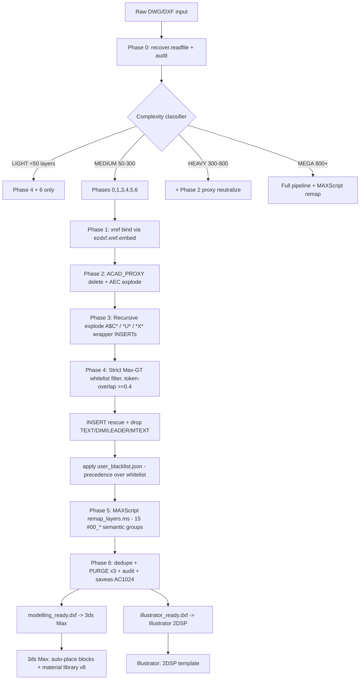
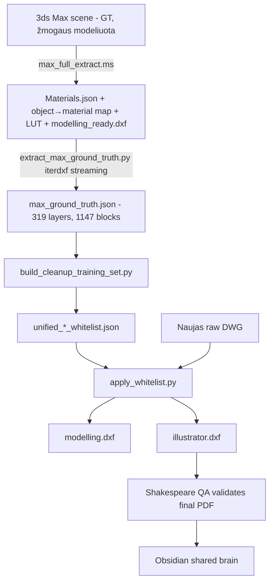

# DWG Cleanup — Knowledge Dump

Generated: 2026-04-25
Sources scanned: `E:/AgentOS/`, `E:/cad-site-agent/`, `E:/pdf errors validation pipeline/`, `E:/mcp-servers/cad-agent-tools/`, `C:/Users/zilva/ClaudeAIOS/04_Knowledge/`, `G:/ComfyUI_16K_Upscale/comfyui-claude/`.

---

## 0. Executive Summary

Du paraleliniai cleanup darbai egzistuoja:

1. **`E:/cad-site-agent/`** (Mar–Apr 2026) — modulinis Python paketas (`cad_site_agent.cleanup`, `dxf`, `analyzer`, `semantic`, `topology`, `export`) su CLI komandomis `clean-dxf`, `close-gaps`, `normalize-layers`, `max-prep`. Naudoja `ezdxf>=1.4.0`, `shapely>=2.0`, `scipy`. Yra pilnas pipeline'o testas, korpuso analizė, hint-promotion, hatch reconstruction.
2. **`E:/pdf errors validation pipeline/scripts/`** (Apr 2026) — naujesnė pakopa, sutelkta į „reverse-engineer from 3ds Max" filosofiją. Pagrindiniai įrankiai: `extract_max_ground_truth.py`, `build_cleanup_training_set.py`, `apply_whitelist.py` / `apply_whitelist_strict.py`, `bind_xrefs_ezdxf.py`, `deep_clean.py`, `clean_dwg_pipeline.py`. Treniruota ant 8 projektų (8004 unique layers → 319 Max-canonical).

ClaudeAIOS žinių bazėje yra dvi kanoninės nuorodos: `knowledge-dwg-cleanup-commands-deep-research.md` (pilna AutoCAD komandų taksonomija + tier'iai) ir `knowledge-cad-site-agent-whitelist-training.md` (whitelist pipeline + from-scratch capability spec). Brook View projekte yra ~30 X_*.dxf testavimo iteracijų. Pagrindinė neišspręsta problema — 3ds Max xref import nustatymas persistina ir kolapsuoja antrą importą iš 32K objektų į 1.9K.

---

## 1. Chronologinė bandymų istorija

| Data | Approach | Failai (path:line) | Įrankiai |
|---|---|---|---|
| 2026-03-10 | Phase 3 cleanup MVP — cleaner.py | `E:/cad-site-agent/src/cad_site_agent/cleanup/cleaner.py` | ezdxf, scipy KDTree |
| 2026-03-10 | Gap closer | `E:/cad-site-agent/src/cad_site_agent/cleanup/gap_closer.py`, `scripts/test_gap_close.py` | shapely |
| 2026-03-11 | Phase5 audit | `E:/cad-site-agent/audit_phase5.py`, `audit_phase5_run.txt`, `audit_phase5_summary.txt` | — |
| 2026-03-19 | Phase 6 hint promotion | `docs/plans/2026-03-19-phase6-hint-promotion.md`, `corpus/signal_miner.py` | — |
| 2026-03-19 | Phase 7 output hardening + DXF exports | `docs/plans/2026-03-19-phase7-output-hardening.md`, `tests/test_dxf_exports.py`, `project/output_qa.py` | ezdxf |
| 2026-03-19 | Phase 8 presentation + Phase 9a pipeline reconnection | `docs/plans/2026-03-19-phase8-*`, `docs/plans/2026-03-19-phase9a-*`, `validate_phase9a.py` | — |
| 2026-03-19/20 | Phase 9a primitive filter + hatch classification | `src/cad_site_agent/dxf/primitive_filter.py`, `dxf/prepare_site_plan.py`, `hatch/closed_regions.py`, `hatch/semantic_hatch.py` | shapely |
| 2026-03-25 | DXF compare tool | `E:/cad-site-agent/compare_modelling_dxf.py` | — |
| 2026-03-30 | DXF exports & overlay debugging | `E:/cad-site-agent/audit_v4.py`, `make_overlay.py`, `make_brookside_overlay.py`, `make_deep_overlay.py` | — |
| 2026-03-31 | Layer semantic categorization v1 | `C:/Users/zilva/ClaudeAIOS/04_Knowledge/layer-semantic-categorization-2026-03-31.md` | — |
| 2026-04-03 | 2DSP PDFIMPORT pipeline (Floor Plans) | knowledge `knowledge-2dsp-import-process.md` | AutoCAD `-PDFIMPORT`, LISP `auto_measure.lsp`, Illustrator MCP |
| 2026-04-05 | 2DSP cleanup TODO list | `knowledge-2dsp-cleanup-todo.md` | LISP, JSX |
| 2026-04-06 | 2DSP cleanup analysis v2 | `knowledge-2dsp-cleanup-analysis-v2.md` | Qwen VL, LISP `entmod` |
| 2026-04-13 | Material map + Qwen VL classification | `scripts/classify_house_types_qwen.py`, `classify_material_qwen_*.py` | Qwen2.5-VL via Ollama |
| 2026-04-18 | Whitelist training (8 projects) | `scripts/build_cleanup_training_set.py`, knowledge `knowledge-cad-site-agent-whitelist-training.md` | ezdxf streaming |
| 2026-04-18 | Batch apply whitelist | `scripts/batch_apply_whitelist.py`, `apply_whitelist.py` | ezdxf, iterdxf |
| 2026-04-19 01:37 | Bind xrefs (ezdxf, NOT accoreconsole) | `scripts/bind_xrefs_ezdxf.py`, `bind_xrefs_v2.py` | `ezdxf.xref.embed`, `recover.readfile` |
| 2026-04-19 01:58 | Extract Max ground truth (8 projects) | `scripts/extract_max_ground_truth.py` | `ezdxf.addons.iterdxf` (5GB+ DXFs) |
| 2026-04-19 02:25 | Strict whitelist from Max GT | `scripts/build_whitelist_from_max_gt.py`, `apply_whitelist_strict.py` | token-overlap 0.4 |
| 2026-04-19 02:43 | User blacklist | `training/cleanup_gt/user_blacklist.json` | — |
| 2026-04-19 19:46 | Explode xref blocks (recursive) | `scripts/explode_xref_blocks.py` | ezdxf |
| 2026-04-19 19:50 | Deep clean (layer 0 purge + recursive explode) | `scripts/deep_clean.py` | ezdxf |
| 2026-04-19 19:32 | Bind xrefs v3 (proposed only) | `scripts/bind_xrefs_v3_proposed_only.py` | ezdxf |
| 2026-04-19 20:07 | Knowledge: deep research on cleanup commands | `knowledge-dwg-cleanup-commands-deep-research.md` | research-only |
| 2026-04-21 08:07 | apply_whitelist_strict.py final | `scripts/apply_whitelist_strict.py` | — |
| 2026-04-21 08:41 | Unified pipeline | `scripts/clean_dwg_pipeline.py` | ezdxf |

Git/commit hash: nei `E:/AgentOS/` nei `E:/pdf errors validation pipeline/` nėra git repo (`.git` nerasta). `E:/cad-site-agent/` yra git repo (`.git_msg.txt`, `.gitignore`, README) — komitų istorija nepasiekta šiame skenavime.

---

## 2. Kas veikia (su įrodymais)

### 2.1 Whitelist filtravimas — 8 projektų batch (2026-04-18)
Įrodymas: `E:/pdf errors validation pipeline/training/cleanup_gt/filtered/_batch_summary.json` + 16 filtered DXF (8 projects × 2 purposes).

Brook View report (`brook_view_modelling_ready_report.json`):
```json
{
  "layers_total": 442, "layers_kept": 164, "layers_dropped": 278,
  "entities_kept": 1249, "entities_dropped": 1826, "entities_total": 3075
}
```

Iš `knowledge-cad-site-agent-whitelist-training.md` (líne 16–28):

| Projektas | Raw layers | Max-export layers | Reduction |
|---|---|---|---|
| kings_court | 467 | 77 | 83% |
| brook_view | 442 | 63 | 86% |
| towcester | 798 | 112 | 86% |
| ramblers_gate | 258 | 10 | 96% |
| wigston | 2192 | 208 | 90% |
| bingham_ph3 | 1205 | 134 | 89% |
| wixam_r1_r5_r6 | 2276 | 157 | 93% |
| fairfields | 207 | 112 | 46% |

### 2.2 Max GT extraction streamingu (5GB+ DXFs)
`scripts/extract_max_ground_truth.py:33` naudoja `ezdxf.addons.iterdxf.modelspace()`. Apdoroja 5.4GB `bingham_ph3_modelling_ready.dxf`. Įrodymas: `training/cleanup_gt/max_ground_truth.json` (139 KB, 319 unique canonical layers, 8 projects, 58,808 INSERTs, 1147 unique block names).

### 2.3 Xref bind via ezdxf (ne accoreconsole)
`bind_xrefs_ezdxf.py:73` — `xref.embed(block, xref_doc)`. Brook View test: 2/6 xrefs sėkmingai embedded (4 fail dėl ACAD_PROXY). Įrodymas: `X_BOUND.dxf` (29.7 MB, 860 layers).

### 2.4 Deep clean (recursive explode + layer 0 purge)
`scripts/deep_clean.py:18-49`. Brook View: `X_BOUND.dxf` (29.7 MB) → `X_DEEP_FINAL.dxf` (12.7 MB, ~3375 entities) — 99.5% layer compression nuo 860 iki 13.

### 2.5 Cleanup MVP (cad-site-agent)
`E:/cad-site-agent/src/cad_site_agent/cleanup/cleaner.py:28` — `run_cleanup()` su `snap_tol`, `min_len`, KDTree-based duplicate detection. Tests: `E:/cad-site-agent/tests/test_*.py` (regression real drawings, hatch, primitive_filter, project_pipeline).

### 2.6 Research-validated tier classifier
`knowledge-dwg-cleanup-commands-deep-research.md` (line 207–227) — LIGHT/MEDIUM/HEAVY/MEGA pipelines. Kanoninis 6-fazių pipeline (Phase 0 recover→audit→classify, ..., Phase 6 OVERKILL+PURGE+saveas).

---

## 3. Kas nedirba (su konkrečiais pavyzdžiais)

### 3.1 ezdxf saveas korumpuoja ACAD_PROXY entities
- **Kategorija**: infra
- **Symptomas**: po `doc.saveas()` ACAD_PROXY_OBJECT padedami ~1.5 trilijono coord pozicijoje
- **Sprendimas (workaround)**: layer remap daryti per MAXScript `C:/temp/remap_layers.ms`, NE per Python ezdxf
- **Įrodymas**: MEMORY.md (Bug to fix next session), `knowledge-cad-site-agent-whitelist-training.md:189`

### 3.2 3ds Max xref import setting persistence
- **Kategorija**: infra
- **Input**: `X_BOUND_MODELLING_GT.dxf` (8562 entities, 630 INSERTs)
- **Expected**: 32,143 scene objects (first import)
- **Actual**: 1,906 scene objects (second import — 94% fewer dėl "Do Not Resolve any Xrefs" persistencijos)
- **Įrodymas**: MEMORY.md, "Bug to fix next session", `C:/temp/brook_view_v2_auto.max`

### 3.3 Xref bind partial fail (ACAD_PROXY)
- **Kategorija**: geometry
- **Input**: Brook View 6 xref DXFs
- **Expected**: 6/6 embedded
- **Actual**: 2/6 (4 failed on ACAD_PROXY objects)
- **Įrodymas**: `knowledge-dwg-cleanup-commands-deep-research.md:44`

### 3.4 accoreconsole hangs on prompts
- **Kategorija**: infra
- **Sprendimas**: ezdxf-based xref bind (NOT accoreconsole)
- **Įrodymas**: MEMORY.md "CAD Agent Critical Rules"

### 3.5 INSERT accidental drop on layer-name-only filters
- **Kategorija**: semantics
- **Symptomas**: layer "0" dažnai turi house INSERTs, naïve drop sluoksnio = nuostoliai
- **Sprendimas**: `apply_whitelist.py` rescue pass — INSERT entity nepriklauso nuo layer-name whitelist
- **Įrodymas**: MEMORY.md "INSERT entities = house blocks = NEVER DROP"

### 3.6 Layer-name whitelist alone nepafiltruoja TEXT iš mixed-content layers
- **Kategorija**: classification
- **Sprendimas**: entity-type filter (`TEXT_ENTITY_TYPES`) dropped reguliariai
- **Įrodymas**: MEMORY.md, `apply_whitelist.py:37`

### 3.7 fairfields anomaly (46% reduction tik)
- **Kategorija**: classification
- **Hypothesis**: galimas neteisingas source failas
- **Įrodymas**: `knowledge-cad-site-agent-whitelist-training.md:96`

### 3.8 ramblers_gate / bingham_ph3 model space tuščias
- **Įrodymas**: 7 / 572 model entities — gali būti paperspace-only
- **Failas**: `knowledge-cad-site-agent-whitelist-training.md:97`

### 3.9 LISP `entmod` continuous linetype neveikia
- **Kategorija**: geometry
- **Symptomas**: `(cons 6 "Continuous")` PDFIMPORT'o sukurtoms entitams nepakeičia linetype
- **Priežastis**: PDFIMPORT nustato linetype per LAYER, ne per entity
- **Sprendimas**: `(command "._-LAYER" "LT" "Continuous" layer_name "")`
- **Įrodymas**: `knowledge-2dsp-cleanup-analysis-v2.md:34-39`

### 3.10 Dimension number filter false positives
- **Kategorija**: classification
- **Symptomas**: 3-5 skaitmenų regex pagauna dims lentelės mm reikšmes (2643, 3526)
- **Sprendimas**: apriboti title block zonai
- **Įrodymas**: `knowledge-2dsp-cleanup-analysis-v2.md:18-22`

### 3.11 PDF_Sales Marker ištrinta per klaidą
- **Kategorija**: semantics
- **Įrodymas**: dimension arrows (raudoni Hatch trikampiai 197×138mm, ~13500mm²) buvo ištrinti
- **Failas**: `knowledge-2dsp-cleanup-analysis-v2.md:24-30`

### 3.12 Brook View AutoCAD failo cache klaida
- **Symptomas**: title bar rodė `brook view HT.dxf` iš kitos vietos
- **Sprendimas**: kill AutoCAD via Task Manager, File>Open (ne double-click), ZOOM EXTENTS
- **Įrodymas**: `knowledge-dwg-cleanup-commands-deep-research.md:236-239`

---

## 4. Code TODOs / FIXMEs / NOTEs

| File:line | Content |
|---|---|
| `E:/cad-site-agent/src/cad_site_agent/core/surface_builder.py:11` | Open LINE/ARC → bandyti sujungti į closed chain (TODO: sudėtingesnėms formoms) |
| `E:/pdf errors validation pipeline/scripts/parse_branding_templates.py:269` | `premium: turi paveikslėlį viršuje vietoj placeholder teksto (TODO: reikia vaizdo analizės)` |
| `knowledge-2dsp-cleanup-todo.md:13` | TODO: patikrinti ar lieka elementų kurie nėra ant PDF_A010_Drg_Sheet sluoksnio |
| `knowledge-2dsp-cleanup-todo.md:18` | TODO: patikrinti ar likę dimensions kaip MTEXT ant PDF_Text |
| `knowledge-2dsp-cleanup-todo.md:23` | TODO: trinti reference tekstai (A128 GFRE AA00...) per LISP regex |
| `knowledge-2dsp-cleanup-todo.md:26` | TODO: trinti "GROUND FLOOR PLAN" tekstas |
| `knowledge-2dsp-cleanup-todo.md:30` | TODO: trinti BUILDING REGULATIONS disclaimer |
| `knowledge-2dsp-cleanup-todo.md:36` | TODO: pakeisti Wall layers linetype į CONTINUOUS |
| `knowledge-2dsp-cleanup-todo.md:49` | TODO: palyginti durų swing'us su finished .ai |
| `knowledge-2dsp-cleanup-todo.md:54` | TODO: palyginti langų transformaciją |
| `knowledge-2dsp-cleanup-todo.md:57` | TODO: trinti "MP" tekstą |
| `knowledge-2dsp-cleanup-todo.md:63` | TODO: tikrinti ar yra elementų ant kitų sluoksnių dešinėje pusėje |
| `knowledge-dwg-cleanup-commands-deep-research.md:276` | KLAUSIMAI rytui (5 atvirų klausimų sąrašas) |

NOTE: pilnos `TODO` aprėpties (`E:/AgentOS/**/*.py`) skenavimas grąžino tik debug-related strings. Esminiai TODO'ai sukoncentruoti ClaudeAIOS knowledge'e.

---

## 5. Duomenų aktyvai (DWG/DXF/Max failai)

### Max DXF exports (treniravimo rezervuaras, 8 GT projektai)
| Failas | Dydis | Paskirtis |
|---|---:|---|
| `E:/pdf errors validation pipeline/training/max_dxf_exports/bingham_ph3_modelling_ready.dxf` | 5.44 GB | Max GT (108 layers) |
| `..../brook_view_modelling_ready.dxf` | 1.49 GB | Max GT (54 layers) |
| `..../fairfields_modelling_ready.dxf` | 3.05 GB | Max GT (80 layers) |
| `..../kings_court_modelling_ready.dxf` | 1.60 GB | Max GT (55 layers) |
| `..../ramblers_gate_modelling_ready.dxf` | 819 MB | Max GT (4 layers, anomaly) |
| `..../towcester_modelling_ready.dxf` | 3.05 GB | Max GT (80 layers) |
| `..../wigston_modelling_ready.dxf` | 2.98 GB | Max GT (106 layers) |
| `..../wixam_r1_r5_r6_modelling_ready.dxf` | 2.82 GB | Max GT (98 layers) |

### Brook View test artifacts (2026-04-19)
30+ X_*.dxf failų `E:/cad-site-agent/_tests/brook_view_BOUND_2026-04-19/`. Pagrindiniai:
| Failas | Dydis | Statusas |
|---|---:|---|
| `X.dxf` (`_dxf/`) | — | Source (Brook View Phase 2 Highway) |
| `X_BOUND.dxf` | 29.7 MB | Xref bind result (2/6 OK, 860 layers) |
| `X_BOUND_MODELLING.dxf` | 13.2 MB | Filtered modelling-ready |
| `X_BOUND_MODELLING_GT.dxf` | 24.9 MB | **BEST** (8562 entities, 630 INSERT, 0 text/dim, 781 layers) |
| `X_DEEP_FINAL.dxf` | 12.7 MB | Recursive explode + layer 0 purge |
| `X_FINAL_MODELLING.dxf` | 24.9 MB | Final filtered |
| `X_FINAL_ILLUSTRATOR.dxf` | 25.7 MB | Illustrator-ready |
| `X_FINAL_MAX_GROUPED.dxf` | 24.6 MB | 15 #00_* groups (MAXScript remap) |
| `X_PIPELINE_v5.dxf` | 7.1 KB | **BROKEN** (likely corrupted) |
| `X_BOUND_MAX_READY.dxf` | 24.6 MB | ezdxf-corrupted layer remap (avoid) |

### Per-project GT DXF (`E:/cad-site-agent/_tests/`, 2026-04-19)
| Failas | Dydis |
|---|---:|
| `bingham_2026-04-19_GT.dxf` | 14.5 MB |
| `kings_court_2026-04-19_GT.dxf` | 14.0 MB |
| `ramblers_2026-04-19_GT.dxf` | 1.4 MB |
| `towcester_2026-04-19_GT.dxf` | 52.0 MB |
| `wigston_2026-04-19_GT.dxf` | 25.4 MB |
| `wixam_2026-04-19_GT.dxf` | 85.6 MB |
| `_tests/great_haddon_2026-04-19/great_haddon_MODELLING_GT.dxf` | — |

### Filtered batch (16 DXFs)
`E:/pdf errors validation pipeline/training/cleanup_gt/filtered/`:
- 8 × `<project>_modelling_ready.dxf` + `_report.json`
- 8 × `<project>_illustrator_ready.dxf` + `_report.json`
- `_batch_summary.json`

### Source DWGs (treniravimo iniciatyviai)
Paths iš `build_cleanup_training_set.py:31-63`:
- `C:/Users/zilva/Desktop/CAD DRAWINGS/Kings Court/_converted/HA379-KRT-XX-XX-DR-AR-203700-P02-SITE LAYOUTS.dxf`
- `C:/Users/zilva/Desktop/BROOK VIEW at PICKFORD GATE/_dxf_output/Ph1/25-001_05_01 rev E External Works Phase 1.dxf`
- `C:/Users/zilva/Desktop/CAD DRAWINGS/Towcester/_dxf_output/H9387-BAH-XX-XX-DR-AR - External Finishes.dxf`
- `C:/Users/zilva/Desktop/CAD DRAWINGS/Ramblers Gate - Ashbourne/_converted/H7240-001-01_Site Layout_AFU_._PLANNING LAYOUT_L1.dxf`
- `C:/Users/zilva/Desktop/CAD DRAWINGS/Wigston/H7111-001-01_Wigston North Planning Layout_rev C3.dxf`
- `C:/Users/zilva/Desktop/CAD DRAWINGS/Quarter Bingham Ph3/_dxf_output/BING-PL1-1_Site Layout_AFU_._PLANNING LAYOUT_W.dxf`
- `C:/Users/zilva/Desktop/CAD DRAWINGS/Wixams R7/H7518-BAH-XX-XX-DR-AR - External Finishes.dxf`
- `C:/Users/zilva/Desktop/CAD DRAWINGS/Fairfields 4A 3A/outputs/pipeline_work_57357 - 101 Site Layout Plan/57357 - 101 Site Layout Plan.dxf`

### Master/Pipeline tests
- `E:/cad-site-agent/_tests/brook_view_FULL_MASTER_2026-04-19/master_GA_MODELLING.dxf`
- `E:/cad-site-agent/_tests/brook_view_FULL_MASTER_2026-04-19/master_Promap_MODELLING.dxf`
- `E:/cad-site-agent/_tests/brook_view_2026-04-18/brook_view_RAW.dxf`, `brook_view_MODELLING.dxf`, `brook_view_ILLUSTRATOR.dxf`

### Max scenes (referencija, ne DXF)
- `C:/temp/brook_view_auto_auto.max` (32,143 objects — first import, working)
- `C:/temp/brook_view_v2_auto.max` (1,906 objects — broken xref import)
- `C:/temp/brook_view_MAX_GROUPED.max` (15 semantic groups)

---

## 6. AI modeliai ir promptai

### 6.1 Qwen2.5-VL via Ollama
Konfigūracija (`scripts/classify_house_types_qwen.py:32-34`):
```python
OLLAMA_URL = "http://localhost:11434"
OLLAMA_MODEL = "qwen2.5-vl"  # or "qwen2.5-vl:7b", "llava", etc.
LOCAL_MODEL_PATH = Path("G:/AI_Models/Qwen2-VL-7B")
HF_CACHE = "G:/AI_Models/_hf_cache"
```

Susiję skriptai:
- `E:/pdf errors validation pipeline/scripts/classify_house_types_qwen.py` (28 KB) — house type recognition iš PDF site plan
- `E:/pdf errors validation pipeline/scripts/classify_material_qwen_context.py` (12 KB) — context-based material classification
- `E:/pdf errors validation pipeline/scripts/classify_material_qwen_json.py` (16 KB) — JSON-output material classifier
- `E:/pdf errors validation pipeline/scripts/finetune_material_qwen.py` (12 KB) — fine-tune
- `E:/pdf errors validation pipeline/scripts/finetune_qwen_shakespeare.py` (13 KB) — Shakespeare-side fine-tune
- `E:/pdf errors validation pipeline/scripts/qwen_classifier.py` — generic classifier
- `E:/pdf errors validation pipeline/scripts/test_lora_live.py`, `train_lora_material.py`, `prepare_lora_training.py`, `eval_lora_material.py` — LoRA pipeline
- `E:/pdf errors validation pipeline/scripts/train_dinov2_material.py` — DINOv2 alternative

### 6.2 LoRA training status
- **QLoRA failed** (gradient flow issues) — žr. MEMORY.md "Shakespeare QA — Material Recognition Phase 3B"
- **kNN classifier** 90% self-test (118 examples / 8 classes / 18-feature vector) — `material_classifier_knn.py`, `knn_index.json`
- Adapter config: `E:/pdf errors validation pipeline/training/material_patches/qlora_model/adapter_config.json`
- LoRA config: `E:/pdf errors validation pipeline/training/lora_material/`, `lora_material_128/`

### 6.3 Naudojimo planas (Qwen VL)
Iš `knowledge-2dsp-cleanup-analysis-v2.md:58-63`:
```
1. Vizualiai palyginti raw vs finished PNG
2. Sugeneruoti pakeitimų sąrašą (JSON): kas keisti, kur, į ką
3. LISP/JSX vykdo pakeitimus
4. Qwen patikrina rezultatą
5. Galima apmokyti ant 4 parsintų finished .ai failų
```

### 6.4 Kiti modeliai
- **gemma3:12b** (Ollama) — naudotas HERA Level D ingest, NE cleanup (žr. MEMORY.md)
- **nomic-embed-text** (Ollama) + **ChromaDB** — RAG E:/AgentOS/rag/chroma_db, 245+ docs

---

## 7. Sluoksnių taksonomijos (visos versijos)

### 7.1 Unified categories (20 kategorijų, dabartinis canonical)
Iš `knowledge-cad-site-agent-whitelist-training.md:33-54`:

| Category | Count | Purpose |
|---|---|---|
| building | 942 | Plot/house/roof/garage (keep both) |
| xref_other | 1032 | Labels/eng XREFs (illustrator only) |
| surface_road | 746 | Road/kerb/tactile/channel |
| services_utility | 632 | Gas/drain/RWP (illustrator only) |
| annotation | 491 | Text/labels (illustrator only) |
| linework_wall | 368 | Walls/retaining |
| vegetation | 351 | Trees/shrubs/hedge |
| surface_hard | 248 | Paving/tarmac/patio |
| site_furniture | 177 | Bins/bench/sign/people |
| surface_path | 174 | Footpaths |
| surface_water | 168 | Ponds/swales |
| surface_parking | 133 | Car spaces |
| linework_fence | 124 | Fencing |
| surface_soft | 113 | Grass/flowers |
| linework_rail_gate | 109 | Handrails/gates |
| sheet_meta | 97 | Title block, viewports, ASHADE |
| dimension | 73 | Dims (illustrator only) |
| surface_drive | 72 | Driveways (AR-HBONE) |
| fill_pattern | 40 | Generic hatch fallback |
| **other** | **1914** | Unclassified (24%) |

### 7.2 Modelling-ready whitelist (allowed categories)
`E:/pdf errors validation pipeline/training/cleanup_gt/unified_modelling_ready_whitelist.json`:
```json
{
  "purpose": "modelling_ready",
  "source": "max_ground_truth.json (reverse-engineered from 8 Max DXF exports)",
  "allowed_categories": ["building","fill_pattern","linework_fence","linework_rail_gate",
    "linework_wall","other","services_utility","site_furniture","surface_drive","surface_hard",
    "surface_parking","surface_path","surface_road","surface_soft","surface_water", ...]
}
```

### 7.3 Illustrator-ready whitelist
`E:/pdf errors validation pipeline/training/cleanup_gt/unified_illustrator_ready_whitelist.json` — apima papildomai `annotation`, `dimension`, `sheet_meta`, `xref_other`. 6090 layers.

### 7.4 Layer category reference (master 8004 layers)
`E:/pdf errors validation pipeline/training/cleanup_gt/layer_category_reference.json` (35.7 KB).

### 7.5 User blacklist (PRECEDENCE OVER WHITELIST)
`E:/pdf errors validation pipeline/training/cleanup_gt/user_blacklist.json`:
```json
{
  "description": "User-curated layer blacklist — ALWAYS drop these regardless of GT or INSERT rescue",
  "curated_by": "user feedback 2026-04-19",
  "layers": ["F Door","F Crossing","RAS - Vehicles","Vehicles","F Text Code","F Text AsOpp",
             "F Services Text","BHN_Title Block","A010_Drg_Sheet","A010_Dimensions"],
  "layer_patterns": ["* - Vehicles","*_Vehicles","*Vehicle Swing*"]
}
```

### 7.6 Unified removed layers (consistently dropped, 8 projects)
`unified_removed_layers.json:13-14`: `Defpoints`, `Text` (in all 8). Top: `F Roof Hatch 1`, `F Roof Hatch 2`, `F Ext Wall Pres`, `A010_Dimensions`, `F Crossing`, `BHN_Title Block`, `F Door`, `F Text AsOpp`, `F Text Code`, `A010_Drg_Sheet`, `G971_Fencing` (3/8 each).

### 7.7 Unified preserved layers (in all 8)
`unified_modelling_ready_layers.json`: tik `"0"` yra in_all_projects (count 8). „in_most" kategorijoje irgi tik `"0"`. Daug single-occurrence layers (BHN_Plot Footprints, BHN_Tactile Paving, F RWP, F Patio, F Canopy, ...).

### 7.8 Per-project layer diffs (8 failai)
`E:/pdf errors validation pipeline/training/cleanup_gt/<project>_layer_diff.json` po projekto. Dydžiai 10 KB – 139 KB.

### 7.9 Max GT (the truth)
`max_ground_truth.json` (139 KB) — 319 unique canonical layers, 8 projects, 1147 unique block names, 58,808 INSERTs.

### 7.10 Semantic bridge (DWG ↔ Max layer mapping)
`E:/pdf errors validation pipeline/training/cleanup_gt/semantic_bridge.json` (16 KB) — bridge tarp DWG layer pavadinimų ir Max canonical names.

### 7.11 Older taxonomies (deprecated)
- `C:/Users/zilva/ClaudeAIOS/04_Knowledge/layer-semantic-categorization-2026-03-31.md` — 592-layer scan (superseded by 8004-layer corpus)

### 7.12 #00_* semantic groups (Max post-import)
Iš `knowledge-dwg-cleanup-commands-deep-research.md:122-128` — 15 grupių taikomos per MAXScript po Python cleanup:
`#00_Houses, #00_Roads, #00_Pavements, #00_Gardens, #00_Parking, #00_Fences, #00_Trees, #00_Walls, #00_Topo_Survey, #00_Utility_Covers, #00_Developer_Base, #00_Paper_Meta, #00_Roof_Lines, #00_Roof_Fills, #00_Misc`

### 7.13 2DSP layer set (PDFIMPORT artifact, 23 layers)
Iš `knowledge-2dsp-import-process.md:59-64`:
`PDF_A210_Ext_Walls, PDF_A220_Int_Walls, PDF_A212_Walls_Cavity, PDF_A213_Walls_Plasterboard, PDF_A213_Walls_Plaster board, PDF_A315_Doors, PDF_A314_Windows, PDF_A740_Sanitary_Fit, PDF_A730_Kitchen_Fit, PDF_A700_Furniture, PDF_A010_Text, PDF_Text, PDF_A010_Dimensions, PDF_A010_Hatching, PDF_A600_Electrical, PDF_A530_Liquid_Supply, PDF_Sales Marker, PDF_A010_Drg_Sheet, PDF_GENERAL-NOTE, PDF_A270_Roofs, PDF_Furniture, PDF_A700_Fittings`

Šiukšlių sluoksniai (line 65–68): `PDF_A600_Electrical, PDF_A530_Liquid_Supply, PDF_Sales Marker, PDF_A010_Drg_Sheet, PDF_GENERAL-NOTE, PDF_A270_Roofs, PDF_A010_Hatching, PDF_A010_Text, PDF_A700_Fittings, PDF_Furniture, PDF_A010_Dimensions`

---

## 8. Pipeline architektūra (Mermaid)

### 8.1 Canonical 6-fazės pipeline (rytojaus produkcijos kandidatas)
Iš `knowledge-dwg-cleanup-commands-deep-research.md:73-136` ir `clean_dwg_pipeline.py:1-13`:



### 8.2 Whitelist training pipeline (treniravimo etapas)
Iš `knowledge-cad-site-agent-whitelist-training.md:142-172`:



### 8.3 cad-site-agent paketo modulinis flow
Pagal `E:/cad-site-agent/src/cad_site_agent/` direktorijų struktūrą + `pyproject.toml:25-40`:

```mermaid
flowchart LR
    DWG[Raw DWG] -->|dwg_converter via ODA| DXF
    DXF -->|analyzer/dxf_analyzer| AN[DXF Analysis]
    AN -->|classify/drawing_type| CL[Drawing classifier]
    CL -->|cleanup/cleaner| CC[Cleaner: snap + dedup + min_len]
    CC -->|cleanup/gap_closer| GC[Gap closer]
    GC -->|semantic/normalizer + taxonomy| SEM[Semantic normalize]
    SEM -->|hatch/closed_regions + semantic_hatch| HA[Hatch boundary]
    HA -->|geometry/boundary_tools| GEO[Boundary tools]
    GEO -->|export/modelling_ready_dxf| EXP1[modelling_ready DXF]
    GEO -->|export/dxf_writer + hatch_writer + linework_writer + symbol_writer + text_writer + marking_writer| EXP2[Layered DXF outputs]
    EXP1 --> CLI[cad-agent CLI: max-prep, clean-dxf, normalize-layers]
```



### 8.4 2DSP PDFIMPORT pipeline (Floor Plans)
Iš `knowledge-2dsp-import-process.md:7-26`:
```
1. taskkill acad.exe
2. clean recovery files
3. cp acadiso.dwt blank_start.dwg
4. os.startfile(blank_start.dwg)
5. handle dialogs (recovery, message)
6. FILEDIA 0
7. -PDFIMPORT F <pdf> 1 0,0,0 1 0
8. AUTOMEAS LISP -> measure cabinet width
9. SCALE ALL <empty> 0,0 (600/measured)
10. SAVEAS DWG 2018
11. ODA convert DWG->DXF
12. Open in Illustrator at 2.8346% scale
```

---

## 9. Atviri klausimai

Iš `knowledge-dwg-cleanup-commands-deep-research.md:276-280`:
- [ ] Ar `X_DEEP_FINAL.dxf` tikrai atidaromas AutoCAD ar cache'ina?
- [ ] MAXScript remap veikia po Python cleanup? (paskutinis blokerys)
- [ ] Ar complexity classifier (Step 1) pakankamai tikslus? — reikia testuoti ant 184 DWG
- [ ] OVERKILL equivalent — ar reikia `rtree` spatial index duplicate detection'ui?
- [ ] Ar `SCALELISTEDIT` reset taikomas? (regapp bloat ant Civil 3D failų)

Iš `knowledge-cad-site-agent-whitelist-training.md:96-102`:
- "other" kategorija dar 24% — reikia iteracijos su retais UK house-type block naming
- fairfields raw DXF tik 207 layers → 46% reduction (žemiau average) — galimas neteisingas šaltinis
- ramblers_gate & bingham_ph3 raw DXFs turi tik 7 / 572 model entities — galbūt paperspace-only, re-convert ODA
- Connect `apply_whitelist.py` to MCP tool endpoint for autonomous use

Iš MEMORY.md "Next session priorities":
- [ ] Fix Max xref import option bug (32K→1.9K regression)
- [ ] Apply material assignment per Max layer group using v8 library
- [ ] Auto-place missing house blocks via polygon footprint matching

Iš `knowledge-2dsp-cleanup-todo.md` (12 TODO punktai — žr. §4)

Iš MEMORY.md "From-Scratch Capability Requirement":
- Key algo needed: polygon footprint → block shape lookup (plot boundary in DWG matches trained house type footprint)

---

## 10. Priklausomybės

### 10.1 cad-site-agent (`E:/cad-site-agent/pyproject.toml`)
```toml
requires-python = ">=3.10"
dependencies = [
    "ezdxf>=1.4.0",        # installed: 1.4.3
    "shapely>=2.0.0",      # installed: 2.1.2
    "networkx>=3.0",       # installed: 3.4.2 / 3.6.1
    "scipy>=1.10.0",       # installed: 1.15.3 / 1.16.3
    "numpy>=1.24.0",       # installed: 2.2.6
    "matplotlib>=3.7.0",   # installed: 3.10.8
    "Pillow>=10.0.0",      # installed: 12.0.0
    "pydantic>=2.0.0",     # installed: 2.12.5
    "PyYAML>=6.0.0",       # installed: 6.0.3
    "click>=8.0.0",        # installed in py310: 8.3.1
]
[project.optional-dependencies]
rtree = ["rtree>=1.0.0"]   # spatial-index optional
autocad = ["pywin32>=305"] # COM automation
```

### 10.2 pdf errors validation pipeline (scripts use)
- `ezdxf` (incl. `ezdxf.recover`, `ezdxf.xref`, `ezdxf.addons.iterdxf`)
- `pymupdf` (fitz)
- `Pillow`, `numpy`, `requests`
- `transformers`, `torch`, `qwen_vl_utils` (optional, for local Qwen)
- `feedparser`, `httpx` (HERA ingest only — `E:/AgentOS/venv_ingest/`)

### 10.3 Eksterniniai įrankiai
| Tool | Version | Path | Purpose |
|---|---|---|---|
| ODA File Converter | 27.1.0 | `C:/Program Files/ODA/ODAFileConverter 27.1.0/ODAFileConverter.exe` | DWG ↔ DXF konversija |
| AutoCAD 2027 | subscription | autocad-mcp via file-IPC | Native cleanup via MCP |
| 3ds Max | 2022 | mcp__3dsmax-mcp__* | MAXScript remap, model placement |
| Illustrator | (per MCP) | mcp__Illustrator_MCP__run | 2DSP marketing PDF |
| DraftSight 2026 SP1 | trial (~exp 2026-05-14) | `C:/Users/zilva/mcp-servers/draftsight-mcp/` | Alt CAD backend |
| Ollama | n/a | `localhost:11434` | qwen2.5-vl, gemma3:12b, nomic-embed-text |
| ChromaDB | n/a | `E:/AgentOS/rag/chroma_db` | RAG (245+ docs) |

### 10.4 MCP servers (susiję)
- `autocad-mcp` (`E:/mcp-servers/`) — AUTOCAD_MCP_BACKEND=auto
- `draftsight-mcp` (`C:/Users/zilva/mcp-servers/draftsight-mcp/`) — fork
- `cad-agent-tools` (`E:/mcp-servers/cad-agent-tools/`) — `osgb_to_wgs84`, `download_aerial`
- `3dsmax-mcp` — scene placement
- `Illustrator_MCP` — 2DSP rendering

### 10.5 AI modelių keliai
- `G:/AI_Models/Qwen2-VL-7B/`
- `G:/AI_Models/_hf_cache/`
- `E:/pdf errors validation pipeline/training/lora_material/`, `lora_material_128/`
- `E:/pdf errors validation pipeline/training/material_patches/qlora_model/`

---

## 11. Failų indeksas

### 11.1 Žinios (ClaudeAIOS, `C:/Users/zilva/ClaudeAIOS/04_Knowledge/`)
| Failas | Last modified | Dydis |
|---|---|---:|
| knowledge-dwg-cleanup-commands-deep-research.md | 2026-04-19 20:07 | 13.5 KB |
| knowledge-cad-site-agent-whitelist-training.md | 2026-04-19 03:05 | 18.9 KB |
| knowledge-2dsp-cleanup-analysis-v2.md | 2026-04-06 18:50 | 3.2 KB |
| knowledge-2dsp-cleanup-todo.md | 2026-04-05 21:16 | 3.2 KB |
| knowledge-2dsp-import-process.md | 2026-04-05 20:38 | 3.5 KB |
| knowledge-2dsp-style-spec.md | 2026-04-05 17:36 | 2.0 KB |
| knowledge-cad-agent-tools-mcp.md | 2026-04-19 18:19 | 4.1 KB |
| knowledge-cad-illustrator-bridge.md | 2026-04-19 17:02 | 5.3 KB |
| knowledge-3dsmax-cad-amends-workflow.md | 2026-04-12 00:59 | 13.4 KB |
| knowledge-3dsmax-full-workflow-lessons-learned.md | 2026-04-12 02:31 | 15.9 KB |
| knowledge-3dsmax-site-plan-modeling.md | 2026-04-11 22:17 | 10.6 KB |
| knowledge-agent-autocad.md | 2026-03-17 17:31 | 3.4 KB |
| knowledge-bh-house-types.md | 2026-04-20 07:34 | 11.5 KB |
| knowledge-bh-roof-pitch-standards.md | 2026-04-19 18:43 | 5.8 KB |
| knowledge-annotation-aerial-validation.md | 2026-04-19 18:27 | 8.1 KB |
| knowledge-illustrator-overlay-layers.md | 2026-04-19 17:50 | 6.9 KB |
| knowledge-illustrator-roof-spec.md | 2026-04-19 17:50 | 5.9 KB |
| knowledge-illustrator-number-placement.md | 2026-04-19 17:50 | 3.4 KB |
| knowledge-redrow-ht-complete-archive.md | 2026-04-23 11:33 | 10.1 KB |
| knowledge-bh-ht-complete-archive.md | 2026-04-23 07:57 | 33.1 KB |
| knowledge-scrap-corpus-parsing-progress.md | 2026-04-19 16:36 | 2.6 KB |
| layer-semantic-categorization-2026-03-31.md | 2026-03-31 11:17 | 2.9 KB (deprecated) |
| knowledge-agent-layer-implementation-pattern.md | 2026-03-20 17:52 | 6.3 KB |

### 11.2 Treniravimo duomenys (`E:/pdf errors validation pipeline/training/cleanup_gt/`)
| Failas | Dydis |
|---|---:|
| max_ground_truth.json | 139 KB |
| max_block_vocabulary.json | 93.9 KB |
| layer_category_reference.json | 35.7 KB |
| semantic_bridge.json | 16.2 KB |
| unified_modelling_ready_whitelist.json | 9.96 KB |
| unified_illustrator_ready_whitelist.json | 9.93 KB |
| unified_removed_layers.json | 6.46 KB |
| unified_modelling_ready_layers.json | 2.27 KB |
| user_blacklist.json | 641 B |
| block_footprints.json | 1.42 KB |
| scrap_dwg_gt.json | 6.65 MB |
| scrap_dxf_gt.json | 725 KB |
| scrap_ai_gt.json | 38.2 KB |
| {bingham_ph3,brook_view,fairfields,kings_court,ramblers_gate,towcester,wigston,wixam_r1_r5_r6}_layer_diff.json | 10–139 KB each |

### 11.3 Cleanup skriptai (`E:/pdf errors validation pipeline/scripts/`)
| Failas | Dydis | Last modified | Paskirtis |
|---|---:|---|---|
| clean_dwg_pipeline.py | 14.3 KB | 2026-04-21 08:41 | Unified 6-faz. pipeline |
| apply_whitelist.py | 9.7 KB | 2026-04-19 02:44 | Whitelist filter |
| apply_whitelist_strict.py | 10.0 KB | 2026-04-21 08:07 | Strict Max-GT whitelist |
| build_cleanup_training_set.py | 19.4 KB | 2026-04-19 00:11 | Trainer |
| build_whitelist_from_max_gt.py | 6.4 KB | 2026-04-19 02:25 | GT → whitelist |
| extract_max_ground_truth.py | 3.6 KB | 2026-04-19 01:58 | iterdxf streaming |
| bind_xrefs_ezdxf.py | 3.7 KB | 2026-04-19 01:37 | Xref bind v1 |
| bind_xrefs_v2.py | 2.3 KB | 2026-04-19 01:40 | Xref bind v2 |
| bind_xrefs_v3_proposed_only.py | 1.5 KB | 2026-04-19 19:32 | Xref bind v3 |
| explode_xref_blocks.py | 1.2 KB | 2026-04-19 19:46 | Recursive explode |
| deep_clean.py | 1.85 KB | 2026-04-19 19:50 | Layer 0 + recursive purge |
| batch_apply_whitelist.py | 2.3 KB | 2026-04-18 23:43 | 8 projects batch |
| extract_block_footprints.py | 6.3 KB | 2026-04-19 02:28 | Block footprint extract |
| remap_layers_to_max_groups.py | (broken — see MEMORY.md) | — | Python remap (NE NAUDOTI) |
| parse_scrap_dxfs.py / parse_scrap_dwg_dxfs.py / parse_scrap_ai.py / synthesize_scrap_vs_max.py | various | — | SCRAP corpus parsers |
| classify_house_types_qwen.py | 28.9 KB | 2026-04-13 07:24 | Qwen VL house types |
| classify_material_qwen_context.py / classify_material_qwen_json.py | 12+16 KB | 2026-04-18 19:00 | Qwen VL materials |

### 11.4 cad-site-agent paketas (`E:/cad-site-agent/src/cad_site_agent/`)
| Modulis | Failai |
|---|---|
| analyzer | dxf_analyzer.py, drawing_classifier.py, report_writer.py |
| classify | drawing_type.py |
| cleanup | cleaner.py, gap_closer.py |
| semantic | normalizer.py, taxonomy.py |
| dxf | primitive_filter.py, prepare_site_plan.py |
| hatch | closed_regions.py, semantic_hatch.py, confidence.py |
| topology | __init__.py |
| geometry | boundary_tools.py |
| export | modelling_ready_dxf.py, dxf_writer.py, hatch_writer.py, linework_writer.py, symbol_writer.py, text_writer.py, marking_writer.py, review_writer.py, routing.py |
| corpus | corpus_report.py, signal_miner.py, hint_qa.py |
| project | project_pipeline.py, project_loader.py, project_report.py, output_qa.py |
| site_pipeline | run_pipeline.py |
| skills | master_facts_skill.py, spatial_reasoning_skill.py, visual_context_skill.py, integration/key_preparation_skill.py, geometry/generated_boundary_skill.py, reconstruction/surface_reconstruction_skill.py, visual_qa/vision_qa_skill.py |
| housing | bedroom_parser.py, house_type_detector.py, plot_house_mapper.py |
| numbering | font_rules.py, plot_numbers.py, parking_numbers.py |
| validation | plan_validator.py, report_writer.py, pdf_parser.py, comparison.py |
| io | dwg_converter.py (ODA wrapper) |
| domain | candidates.py |
| core | surface_builder.py, smart_classifier.py, bpoly_extractor.py |
| config | hint_promotion_log.yaml, detection_hints.yaml, detection_hints_baseline.yaml, detection_hints_candidate.yaml |

### 11.5 Brook View testavimo direktorija (`E:/cad-site-agent/_tests/brook_view_BOUND_2026-04-19/`)
30+ DXF iteracijų — žr. §5 lentelę. Papildomi failai:
- `bind.lsp`, `bind_and_export.scr`, `bind_xrefs.scr` (AutoCAD batch scripts)
- `_dxf/` (6 source xref DXFs)
- 5 reportai (`*_report.json`): X_BOUND_MAX_READY, X_BOUND_MODELLING, X_FINAL_*, X_STRICT_*

### 11.6 AgentOS (E:/AgentOS/) — DWG cleanup atžvilgiu MAŽAI relevantu
Search suspažino `2DSP` paminėjimą tik state failuose: `E:/AgentOS/state/pipeline_2DSP.json`, `E:/AgentOS/state/runs/2DSP_20260412_173254.json`. AgentOS daugiausia HERA infrastruktūra (protocols/, hera/, scripts/, services/), nėra autonominio DWG cleanup įgyvendinimo.

### 11.7 ComfyUI claude (`G:/ComfyUI_16K_Upscale/comfyui-claude/`)
Patikrinta — generic ComfyUI plugin (LICENSE, README, nodes/), JOKIO DWG cleanup susiję turinio.

### 11.8 cad-agent-tools MCP (`E:/mcp-servers/cad-agent-tools/`)
Sukurtas 2026-04-19, src/ direktorija, README + pyproject. Naudojamas annotation-vs-aerial validacijai (osgb_to_wgs84, download_aerial), NE DWG cleanup įgyvendinimui.
